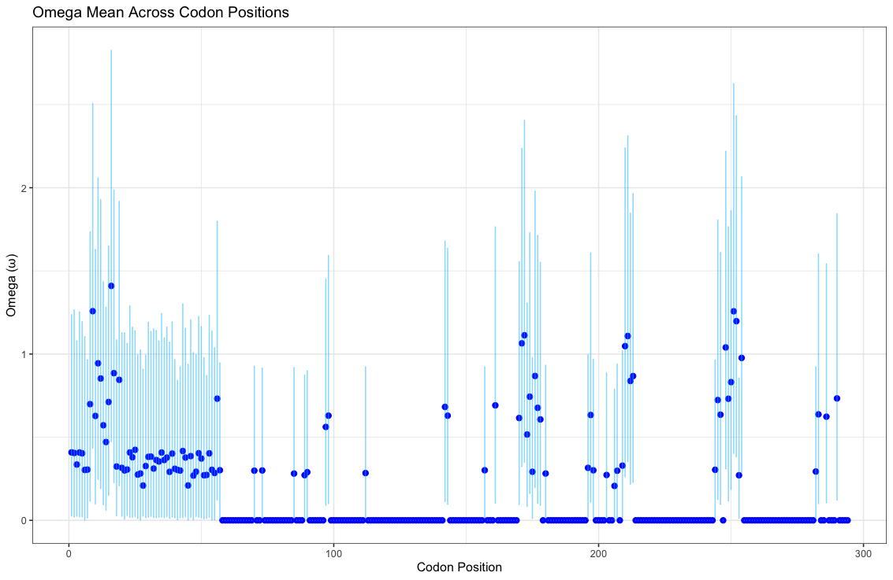

# TOMBOMBADIL

**Tree-free Omega Mapping By Observing Mutations of Bases and Amino Acids Distributed Inside Loci**  
*A Bayesian, codon-level dN/dS estimator using Stan and R*

>    "Old Tom Bombadil is a merry fellow! Bright Blue his jacket is, and his boots are yellow!"
    —Tom Bombadil
---

## Table of Contents

- [What is TOMBOMBADIL?](#what-is-tombombadil)
- [Interpretation of dN/dS (ω)](#interpretation-of-dnds-ω)
- [Installation](#installation)
- [Getting Started](#getting-started)
- [Example: `porinB` Analysis](#example-porinb-analysis)
- [Expected Output](#expected-output)
- [Troubleshooting & Help](#troubleshooting--help)
- [Contributors](#contributors)

---

## What is TOMBOMBADIL?

**TOMBOMBADIL** is a computational tool that estimates the nonsynonymous-to-synonymous substitution rate ratio (dN/dS, or ω) at the **codon level**, using Bayesian inference.

It is written in **Stan** and wrapped in **R**, making it easy to use within RStudio. TOMBOMBADIL leverages **Hamiltonian Monte Carlo (HMC)** via CmdStanR to efficiently sample from the posterior distribution of ω.

Unlike many models that analyse entire genes or regions at once, TOMBOMBADIL performs **single-locus inference**, evaluating each codon site independently. This is useful for detecting site-specific selective pressures.

---

## Interpretation of dN/dS (ω)

| ω Value     | Interpretation                  | Example Genes                                 |
|-------------|----------------------------------|------------------------------------------------|
| **< 1**     | Purifying (Negative) Selection   | Histones, ribosomal proteins                   |
| **= 1**     | Neutral Evolution                | Pseudogenes                                    |
| **> 1**     | Positive (Darwinian) Selection   | Immune system genes, viral surface proteins    |

---

## Installation

TOMBOMBADIL is written in **R** and uses **CmdStanR** to interface with **Stan**.

### Step 1: Install Required R Packages

```r
install.packages("cmdstanr")
install.packages("seqinr")
install.packages("ggplot2")

```
### Step 2: Install CmdStan

After installing [`cmdstanr`](https://mc-stan.org/cmdstanr/), you’ll need to install the CmdStan backend:

```r
cmdstanr::install_cmdstan()
```

> 🔧 **Note:** This step may take several minutes. If you encounter issues, refer to the [CmdStanR installation guide](https://mc-stan.org/install/).

---

## Getting Started

The primary script for running TOMBOMBADIL is [`fit_single_locus.R`](fit_single_locus.R), which includes:

- Example usage of the model
- An alignment file for the `porinB` gene from *Neisseria* as a real-world case study

### To run the script:

1. Open `fit_single_locus.R` in [RStudio](https://posit.co/download/rstudio-desktop/)
2. Run the script line by line or all at once

The script analyses each codon site individually and automatically:

- ⛔ Skips **stop codons**
- ❌ Ignores codons with **no variation**
- 🚫 Ignores codons with **insertions/deletions (indels)**

> ⚠️ **Note:** Depending on your system, you may need to recompile the Stan model locally.

---

## Example: `porinB` Analysis

Included in this repository is an alignment of the `porinB` gene from *Neisseria*. You can use this to estimate dN/dS (ω) per codon.

### Running the example:

```r
source("R_funcs/generate_data.R")
```

### Visualising results:

```r
p <- ggplot(df, aes(x = codon_position, y = omega_mean)) +
  geom_point(color = 'blue', size = 2, alpha = 1) +  # Use geom_point for individual dots
  geom_errorbar(aes(ymin = omega_q5, ymax = omega_q95), width = 0.2, color = 'deepskyblue', alpha = 0.5) +  # Error bars
  labs(title = "Omega Mean Across Codon Positions, PorinB HMC",
       x = "Codon Position",
       y = "Omega (ω)") +
  theme_bw()
```

---

## Expected Output

The script generates a data frame with the following columns:

- `codon_position`: Position of the codon in the alignment
- `omega_mean`: Posterior mean estimate of ω
- `omega_q5`: 5th percentile of the posterior distribution
- `omega_q95`: 95th percentile of the posterior distribution

Example:

```
| codon_position | omega_mean | omega_q5 | omega_q95 |
|----------------|------------|----------|-----------|
| 1              | 0.31       | 0.05     | 0.72      |
| 2              | 1.02       | 0.88     | 1.22      |
| ...            | ...        | ...      | ...       |
```

> ⚠️ **Note:** Positions with no variation or those affected by indels are excluded from the analysis.

---

## Troubleshooting & Help

- **Model won’t run?** Try recompiling the Stan model by deleting cached files and restarting R.
- **Stan errors?** Make sure CmdStan is installed and up to date.
- **Need support?** [Open an issue](https://github.com/YOUR-USERNAME/TOMBOMBADIL/issues) on GitHub.

---

## Contributors

Contributions, feature requests, and bug reports are welcome!
- **Maintainer:** [BacPop Lab](https://www.bacpop.org/) 
- See [LICENSE](LICENSE) for guidelines.