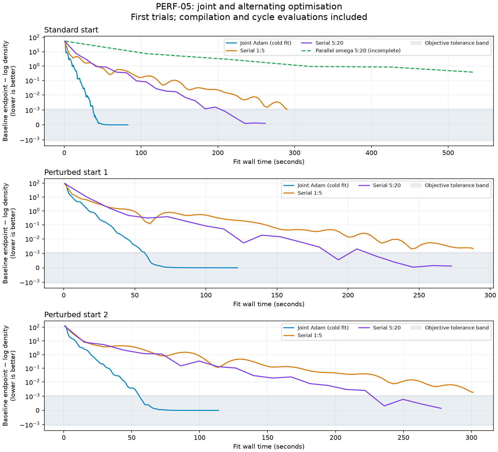

# PERF-05: CPU MAP parallelism and scaling

Baseline: `c9762e18c101102e487b417e558f51ba09384aa8` (post-PERF-04).
Complete: retain production baseline. No joint candidate meets the adoption
gates, and alternating optimisation remains experimental. Protected references
and production code are unchanged.

## Protocol

Joint-Adam adoption requires >=5% faster complete MAP, >=10% faster the largest
common objective/gradient workload, or >=20% lower peak RSS. No runtime
regression is allowed, including startup and placement-inclusive fit time;
other RSS regressions must be <=5%. Capacity alone does not qualify. Repeat
finalists in three fresh processes, extending uncertain/regressing comparisons
to five. Retain all valid trials and use unrounded medians.

Use CPU/float64/NPROC=4, disabled persistent compilation caching and 1/2/4
logical CPU devices. Device configuration precedes JAX imports and preserves
unrelated XLA flags. Logical devices do not imply dedicated physical cores.
Processes run serially, bounded by 12 GiB process RSS and 600 seconds per probe.
Preflight prevents allocating known oversized residual graphs.

Measured on macOS 26.6.2 arm64, 15 physical/logical CPUs and 24 GiB RAM,
using the active mamba environment (Python 3.14.7; JAX/jaxlib 0.8.2).

The workload ladder is repeated PorB3 at 294/2,940/8,820/29,400 sites, with fitted
parameters and scalar omega as controls. These repeats measure computation, not
performance across independent biological datasets. First calls and five
synchronized warm calls are separate. Step probes carry parameters and Adam
state. MAP uses a complete warmup and timed fit, retaining progress reporting
and raw startup measurements, with 500/1e-6/5/10/50 convergence settings.

## Implementations

- `baseline`: frozen original objective and Python optimizer.
- `shard`: distribute count columns, masks and omega using `shard_map`, reduce
  the objective and differentiate it, replicating shared parameters.
- `shard-jit`: compile the mapped objective before differentiating it, screening
  this boundary independently from plain sharding's dispatch overhead.
- `local64`/`local256`: explicitly compute value/gradients inside Python-managed
  chunks, accumulate shared gradients, concatenate ordered omega gradients.
- `shard64`/`shard256`: distribute sites and use bounded local differentiation
  inside `lax.map`; reduce shared gradients across devices explicitly.

Padding duplicates finite input sites and carries zero contribution weights.
Global normalization excludes padding, and the full-input prior is added once.
The optional benchmark `--policy` retains baseline for scalar omega and inputs
below 2,940 sites; numerical checks always exercise the requested implementation.

`shard_map(check_vma=False)` preserves the existing alpha loops, whose initial
zero carries do not carry a varying-axis annotation. Explicit collectives and
independent analytic tests check shared-gradient replication, padding, order,
and normalization. An initial double reduction and a subsequent varying-axis
carry incompatibility were harness implementation errors, corrected before
acceptance measurements. Development probes under `/tmp/perf05` are not
scientific acceptance trials; the final campaign uses `/tmp/perf05-results`.

No eigensolver, derivative, model arithmetic, fixture or tolerance changes are
part of this work. Direct screens compare actual kernels with the protected
one-site oracle and then use initial/fitted/heterogeneous cases and three-step
trajectories. Rejected kernels are not benchmarked for production adoption.

## Experimental alternating optimisation

Compare cycles of 1 shared + 5 omega updates and 5 shared + 20 omega updates,
with a maximum of 500 total block updates. Shared parameters include theta and
eta when estimated. Each block retains its own Adam moments and counter; the
existing cosine schedule advances only when that block is updated, with a
500-update horizon. Frozen blocks and their states remain unchanged.

Serial rounds differentiate only the active block. Phase closures capture the
latest frozen block and are rebuilt after a block change; no stale cache is
retained across shared updates. Full objectives are recorded at cycle boundaries,
and that evaluation/reporting cost is included. Endpoint objectives and gradient
norms are recomputed through the frozen baseline objective. Partial progress is
saved so timeouts remain visible as incomplete runs.
The parallel experiment keeps shared rounds on the baseline and differentiates
only omega through the mapped objective. It has a separate partial-gradient and
two-cycle trajectory gate against the same serial alternating schedule.
Four-device analytic tests exposed a device-placement mismatch after a shared
update. The experimental boundary now replicates unpadded inputs before the
mapped objective so the full prior and likelihood share the same device set;
AD returns gradients to the optimizer input placement. Transfer cost remains in
the experimental timing. Both schedules pass the corrected four-device tests. The two-device scientific
check also matches partial gradients and two full 5:20 cycles exactly on the
recorded cases (maximum absolute error zero).
Joint kernels and completed serial measurements are unaffected.

Use the standard start and two NumPy seed-0 raw perturbations with SD 0.5,
identical across methods. Compare complete 294-site fits; 2,940-site experiments
use a bounded 50-update diagnostic. Rank schedules by how many baseline endpoints
they reach within the unchanged objective tolerance, then total objective
shortfall, then runtime. Repeat the strongest schedule from the standard start
in three fresh processes. Report parameter differences as well as objectives;
objective agreement alone does not establish solution equivalence. This algorithm
remains experimental regardless of its performance.

## Reproduction

These commands reproduce individual probes; they are not the full campaign.
The archive stores every trial's arguments. Rebuilding the complete archive
requires those trial sets (including rejected screens and guarded skips), with
`--worker` omitted so the supervisor applies the resource limits. A numerical
rejection exits with status 1 and is retained as evidence.

```sh
export MPLCONFIGDIR=/tmp/perf05-mpl
export XDG_CACHE_HOME=/tmp/perf05-cache
python -m test.run_parallel_benchmark --variant shard --devices 2 --mode check --output /tmp/perf05-results/shard-d2-check.json
python -m test.run_parallel_benchmark --variant shard --devices 2 --site-repeat 10 --output /tmp/perf05-results/shard-d2-objective-10-1.json
python -m test.run_parallel_benchmark --mode map --output /tmp/perf05-results/baseline-map-start0-1.json
python -m test.run_parallel_benchmark --mode alternate --rounds 1:5 --start 0 --output /tmp/perf05-results/alternate-1-5-start0-1.json
python -m test.run_parallel_benchmark --mode blocks --variant shard --devices 2 --rounds 5:20 --output /tmp/perf05-results/shard-d2-blocks.json
python -m test.run_parallel_benchmark --mode alternate --variant shard --devices 2 --rounds 5:20 --output /tmp/perf05-results/parallel-alternate-5-20-d2-start0-1.json
# After collecting all campaign reports:
python -m test.summarize_parallel_benchmark /tmp/perf05-results --output test/benchmarks/perf05_results.json
python -m test.plot_parallel_benchmark test/benchmarks/perf05_results.json --output test/benchmarks/perf05_convergence.png
```

Use distinct filenames for repeats, and run processes serially. Scientific
checks and analytic tests are separate from acceptance timings. The archive
retains source/input hashes, environment details, raw timings, numerical errors,
resource outcomes and experimental histories.

## Results and limitations

All fourteen changed candidate/device combinations were screened. Plain sharding
passes the protected oracle and the larger numerical/trajectory cases on 1/2/4
devices. All eight chunk-local configurations fail the protected oracle (maximum
absolute difference 2.96765e-5); all three compiled-sharding configurations fail
it too (1.04169e-5). A retained two-device chunk64 diagnostic passes initial and
fitted 294-site comparisons to about 3.6e-14 and 1.1e-14, respectively. Those
larger-case passes do not override the protected failure. Rejected configurations
are excluded from adoption timing; no reference or tolerance is changed.

Five fresh-process primary comparisons (one-device sharding is a one-process
screen and was not selected as a finalist):

| Variant | Trials | First gradient (s) | Warm gradient (s) | Peak RSS (GiB) |
| --- | ---: | ---: | ---: | ---: |
| Baseline | 5 | 4.600972 | 3.990298 | 8.778122 |
| Sharding, one device | 1 | 16.072352 | 14.353484 | 8.051926 |
| Sharding, two devices | 5 | 10.702522 | 12.208023 | 10.792938 |
| Sharding, four devices | 5 | 12.230582 | 12.646882 | 10.471497 |

Plain sharding fails the no-runtime-regression gate. Complete candidate MAP
timing and production installation are therefore unnecessary; complete baseline
MAP fits remain required for the independent alternating comparison. All valid
trials are retained, including the variable early baseline; ratios use unrounded
medians. Allocation guards skip 8,820/29,400-site baseline and finalist probes:
the unbounded residual graph exceeds the same total-host memory budget.

The block-gradient pilot at 2,940 sites measures 5.18 s for shared derivatives
and 5.36 s for omega derivatives (five warm calls, one process). Both pass direct
gradient checks. These pilots do not establish a block-optimisation speedup;
the complete fits and endpoint quality determine the experimental comparison.
Shared-block timing precedes omega-block timing in the same process; the first
omega call may reuse common kernels. Correctness checks run after these timings.

The complete 294-site comparisons below show first-trial fit wall times, with
compilation included. Objective gaps are alternating minus the matching baseline
endpoint; the tolerance is approximately 0.001071. Gradient norms use the same
full baseline objective at every endpoint.

| Start | Schedule | Fit (s) | First objective-quality hit (s) | Objective gap | Gradient norm |
| --- | --- | ---: | ---: | ---: | ---: |
| 0 | Joint Adam | 82.955 | — | 0 | 0.000166 |
| 0 | 1:5 | 290.085 | 290.085 | -0.001042995 | 0.120385 |
| 0 | 5:20 | 261.838 | 209.287 | -0.000101631 | 0.024257 |
| 1 | Joint Adam | 122.228 | — | 0 | 0.000116 |
| 1 | 1:5 | 287.921 | Not reached | -0.001978620 | 0.347553 |
| 1 | 5:20 | 272.673 | 193.107 | -0.000123386 | 0.027207 |
| 2 | Joint Adam | 113.972 | — | 0 | 0.000324 |
| 2 | 1:5 | 301.243 | Not reached | -0.001724222 | 0.250075 |
| 2 | 5:20 | 277.701 | 235.897 | -0.000147232 | 0.067952 |

5:20 reaches endpoint objective tolerance from all three starts, versus one of
three for 1:5, so it was selected for repetition. Three fresh standard-start
trials give median 5:20 fit time 266.152 s (range 261.838–275.838 s), versus
115.912 s for the baseline cold fit (range 82.955–116.329 s). The baseline
timing variability is retained; no valid trial is discarded. 5:20 remains
slower even when judged by its first objective-quality hit. Objective agreement
does not establish equal stationarity or parameter convergence. Across the
three starts, maximum absolute natural-parameter differences from joint Adam
are 0.008547–0.017726 for 1:5 and 0.003174–0.003951 for 5:20.

At 2,940 sites, bounded 50-update runs take 401.886 s / 6.918 GiB for 1:5 and
367.559 s / 6.902 GiB for 5:20. Their endpoint gradient norms are 88.72 and
133.21 respectively; these are incomplete optimization diagnostics, not
converged solutions. They use 9/41 and 10/40 shared/omega updates respectively.

The two-device parallel-omega pilot hit the 600-second worker budget
(601.240 s including supervisor shutdown). Its last completed cycle was at
125 updates (25 shared, 100 omega), 532.407 s and objective -1071.797795288,
well outside the baseline tolerance. Work in the interrupted final cycle is
not counted as a completed cycle. This is an incomplete trial, not a 500-update
fit, and has no independently recomputed endpoint gradient. It was not repeated:
it had already exceeded complete serial-fit times without reaching comparable
objective quality. All partial history and the timeout are retained.



No extrapolation establishes GPU or million-site speed.
The million-site calculation must include count storage, omega/Adam arrays,
reverse-mode residuals and communication. CPU sharding alone does not divide
total host RSS; bounded differentiation is needed to change that scaling.

The connection interruption left a partial 5:20 trial at 425 updates. Its saved
history is archived with `interrupted` status and excluded from completed-trial
statistics. A fresh process restarts from identical initial parameters; completed
trials are retained.

For one million sites, float64 counts alone occupy 488 MB; raw omega plus two
Adam moments occupy 24 MB, with another 8 MB each for omega gradients and the
mask. A single saved `(sites, 61, 61, 61)` float64 residual would occupy about
1.65 TiB. One such residual bounded to 64 sites on four logical devices is about
443 MiB, but that candidate failed numerical validation, and this estimate is
not a peak-memory prediction. Logical CPU devices share the same host RAM.
Shared-gradient collectives and data placement also incur communication and
synchronization costs; no bandwidth or GPU claim follows from these CPU trials.
The naive linear projection from the baseline 2,940-site warm gradient is about
22.6 minutes per million-site gradient, conditional on memory capacity and
unchanged scaling. No million-site execution was attempted.

## Validation and archived evidence

The final post-fix `python -m pytest -q` passes 87 tests and 73 subtests in
220.06 s. The explicit four-device analytic run passes 5 tests and 41 subtests,
including both alternating schedules. Protected likelihood/gradient references,
MAP fixture values and tolerances remain unchanged. Existing upstream warnings
are retained. No candidate was installed, so no separate installed-candidate
confirmation applies; the normal production MAP integration test passes.

[The JSON archive](benchmarks/perf05_results.json) retains 71 reports: 51 completed,
12 expected numerical rejections (11 candidate screens plus the retained chunk
diagnostic), six preflight skips, one connection-interrupted trial and one
resource-timeout trial. All 25 complete objective reports pass direct and
applicable repeated-input checks (maximum direct absolute error 1.819e-12).
The archive contains per-trial and final source hashes, raw timing/gradient
records, histories, resource outcomes, selection decisions and validation logs.
Historical placement-test failure and pre-fix validation logs are labelled
separately from the passing final logs. The convergence plot shows first trials;
median/range statistics retain all valid repeats.

Benchmark CLI help, Python compilation, archive source hashes and diff checks
pass. The next step is review of these results; any numerical-correctness repair,
GPU work or further optimization requires a separate request.
